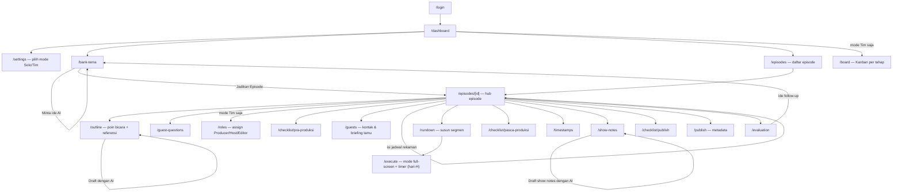

# User Flow — Podcast Prep & Execution

Diagram alur navigasi aplikasi, ditulis retroaktif untuk mengisi gap fase **5 — Desain & User Flow** (dilewati saat awal build, langsung ke PRD → coding). Berguna untuk onboarding kontributor baru dan referensi kalau ada perubahan struktur navigasi nanti.

## Alur Utama

## Catatan per Tahap

| Tahap PRD | Halaman | Siapa yang biasanya pegang (mode Tim) |
|---|---|---|
| Bank Tema | `/bank-tema` | siapa saja |
| Riset & Outline | `/outline`, `/guest-questions` | Host |
| Pra-Produksi | `/checklist/pra-produksi`, `/guests`, jadwal di hub episode | Host |
| Panduan Eksekusi | `/rundown` (susun), `/execute` (hari-H) | Host |
| Pasca-Produksi | `/checklist/pasca-produksi`, `/timestamps`, `/show-notes` | Editor |
| Publish & Distribusi | `/checklist/publish`, `/publish` | Editor |
| Evaluasi | `/evaluation` | siapa saja |

Producer bisa akses semua tahap di atas (lihat `lib/permissions.ts`). Di mode Solo, kolom "siapa pegang" tidak berlaku — satu akun pegang semua tahap.

## Yang Sengaja Tidak Digambar

- Halaman edit (`/outline/[itemId]/edit`, dst.) — variasi CRUD standar dari halaman list-nya masing-masing, tidak menambah pemahaman alur baru.
- Endpoint AI (`/api/ai/*`) — dipanggil dari tombol di halaman terkait (Bank Tema, Outline, Show Notes), bukan halaman terpisah yang dinavigasi user.
